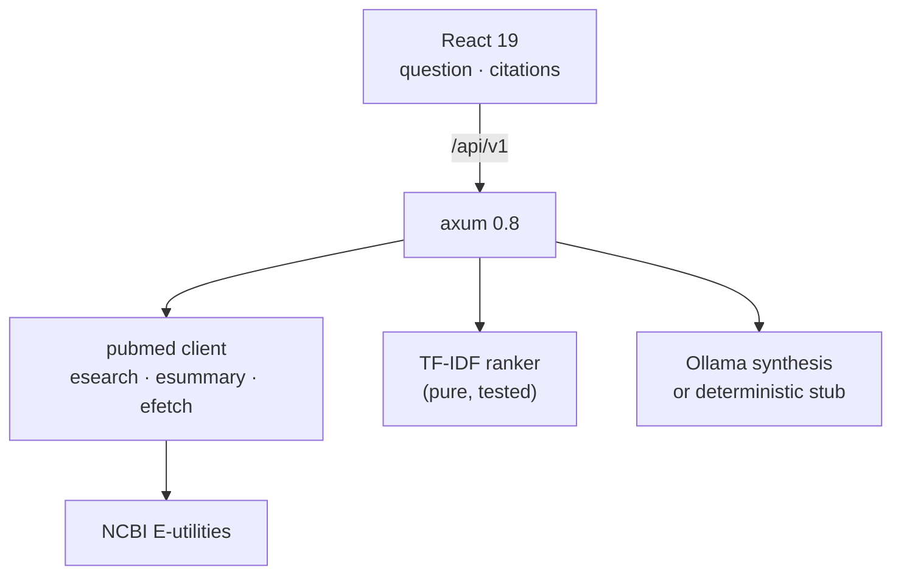

<p align="center">
  <h1>📚 AI Literature Review</h1>
  <p><b>Evidence-based medical literature review — PubMed pipeline, TF-IDF ranking, cited synthesis</b></p>
  <p>
    <a href="https://github.com/akarales/ai-literature-review/actions/workflows/ci.yml"></a>
    
    
    
    
  </p>
</p>

Take a clinical question, search PubMed, rank abstracts by relevance, and
synthesize findings **with citations and confidence scoring** — the
evidence-backed-synthesis pattern healthcare AI actually needs. Rust
(axum) pipeline with a pure TF-IDF ranker and an Ollama synthesis step
(stub mode by default); React client.

**Jump to:** [Features](#-features) · [Architecture](#-architecture) · [Quickstart](#-quickstart) · [Configuration](#️-configuration) · [API](#-api) · [Docs](#-documentation) · [Roadmap](#️-roadmap)

> [!WARNING]
> Evidence summaries from PubMed abstracts. Not medical advice. Verify
> against full texts before any clinical use.

## ⚡ Features

- **PubMed E-utilities integration** — esearch (JSON) → esummary
  (metadata) → efetch (text abstracts), with NCBI etiquette (tool/email
  params, rate limits respected at the caller)
- **Relevance ranking in pure Rust** — TF-IDF cosine over
  title+abstract with stopword filtering; deterministic and unit-tested
- **Synthesis with provenance** — the model receives only the ranked
  evidence and must stay within it; responses carry citations with
  PMIDs, evidence excerpts, and a confidence tied to top relevance
- **Stub-mode LLM** — the demo runs without a GPU

## 📐 Architecture



## 🚀 Quickstart

```bash
cargo run                    # :8006
cd frontend && pnpm install && pnpm dev   # → http://localhost:5173
```

Real synthesis: `APP_MODEL_STUB=false` with Ollama running. PubMed access
needs the network; the short-question contract and the ranker are tested
without it.

## ⚙️ Configuration

| Variable | Default | Notes |
|----------|---------|-------|
| `APP_PORT` | `8006` | 8000–8005 taken on this machine |
| `APP_MODEL_STUB` | `true` | deterministic stub synthesis |
| `APP_OLLAMA_URL` | `http://localhost:11434` | used when stub=false |
| `APP_OLLAMA_MODEL` | `qwen3:14b` | local GPU model |
| `APP_MAX_ARTICLES` | `10` | per-question PubMed fetch cap |

## 📡 API

| Endpoint | Purpose |
|----------|---------|
| `GET /health` | liveness |
| `POST /api/v1/review` | `{question}` → synthesis, citations, confidence |

Payload anatomy: [docs/API.md](docs/API.md).

## 📚 Documentation

| Page | What's inside |
|------|---------------|
| [docs/ARCHITECTURE.md](docs/ARCHITECTURE.md) | PubMed client etiquette, the ranker, synthesis discipline |
| [docs/API.md](docs/API.md) | Review request/response with citations |
| [docs/DEVELOPMENT.md](docs/DEVELOPMENT.md) | Setup, testing, gotchas |

## 🗺️ Roadmap

<details>
<summary>Phased plan</summary>

- [x] Phase 0 — scaffold: client, ranker, synthesis, CI
- [ ] Phase 1 — Ollama embeddings for semantic ranking (up from TF-IDF)
- [ ] Phase 2 — PICO-frame extraction; structured evidence tables
- [ ] Phase 3 — full-text ingestion for top citations (open-access PMCs)

</details>

## 🤝 Contributing

PRs welcome — see [CONTRIBUTING.md](CONTRIBUTING.md). Gates: `cargo
clippy --all-targets -- -D warnings`, `cargo test -q`, `pnpm build`.

## 📄 License

MIT — see [LICENSE](LICENSE).
